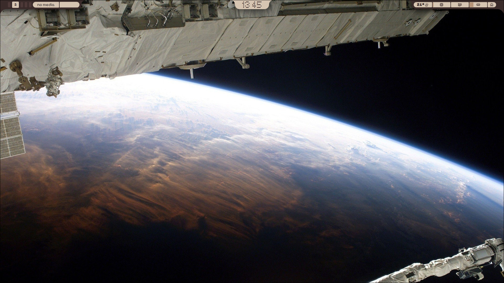
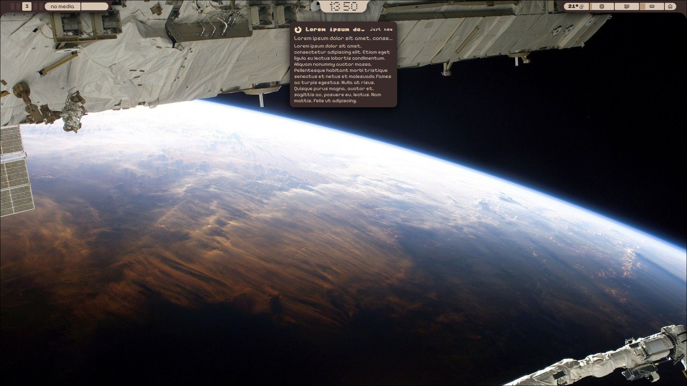
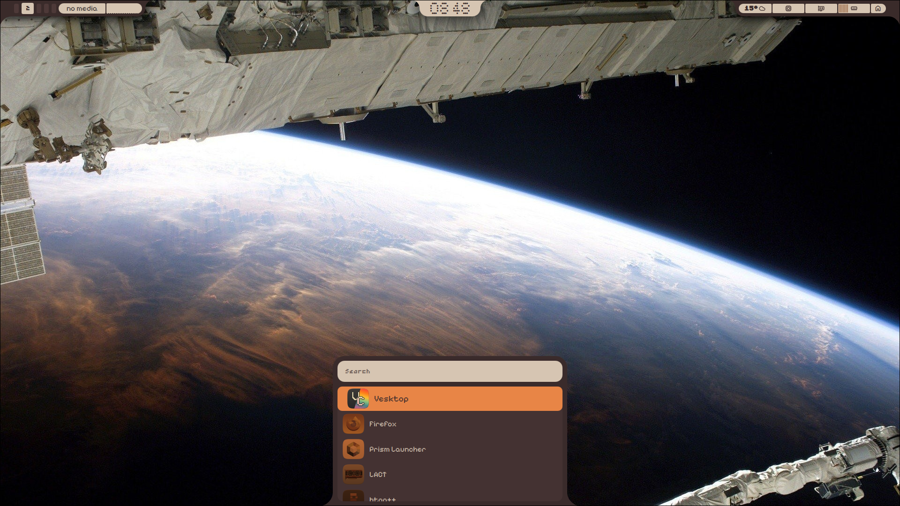
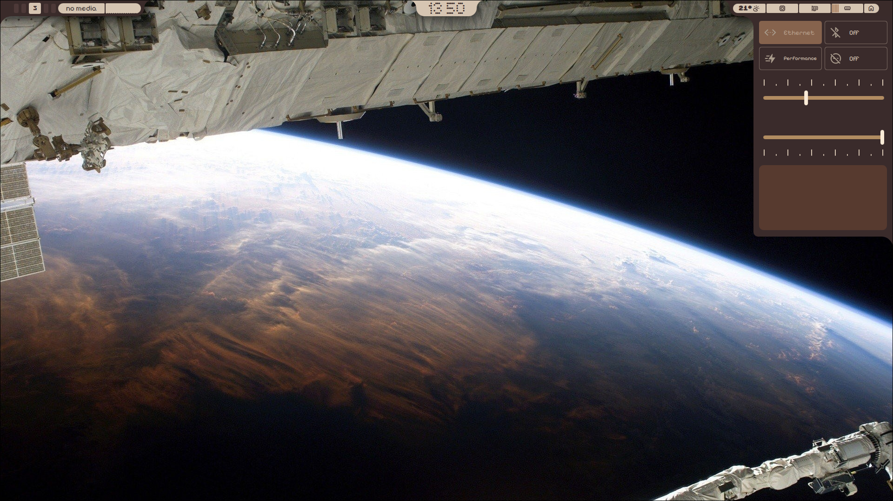
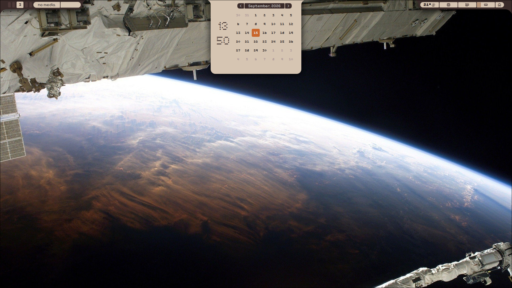
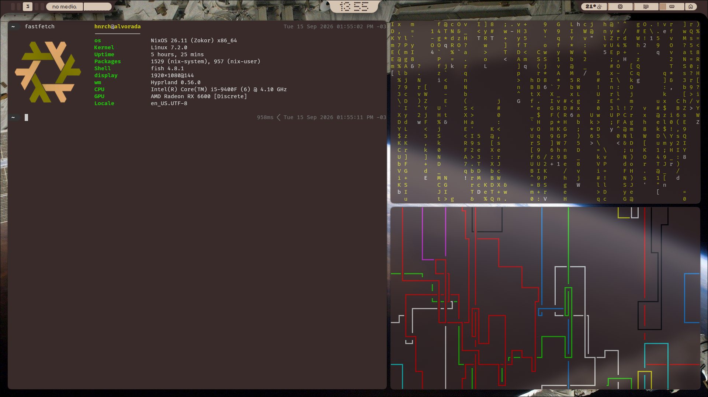

## Softcore Shell
<em>A self centered shell because i don't have other devices to test on</em>

### contents of the shell
___
- **Bar** - tried being different but ended up like caelestia/ii
- **Clock Island** - an excuse to say that there's a dynamic island
- **Media Player** - if you don't have cava installed good luck
- **Notifications** - the only annoying thing is the icon and images

### trying to finish
___
- **Central/Center/Dashboard** - whatever you call it

 <em>desktop</em> 

 <em>notifications</em> 

 <em>launcher</em> 

 <em>central</em> 

 <em>clock island</em> 

 <em>windows</em> 

